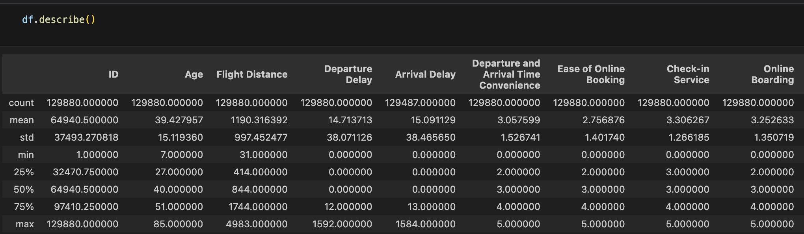

# ibranova_summertime

* [About Me](#About-Me)
* [Skills](#Skills)
* [Projects](#Projects) 
* [Contact](#Contact)

## About Me

I'm from Guinea, I'm studying Data Analytics at the Marcy Lab School. I'm passionnate about tech and finding insights using data!

## Skills

Python, Excel, SQL, Tableau , Data Visualization, Git/Github, Data Storytelling

## Projects 

### Airline Passenger Satisfaction Analysis
- Conducted a full data lifecycle project to analyse feedback from over 120,000 commercial airline passengers, including details about each person, their flight, type of travel, and overall experience.
- Cleaned the data by removing duplicate values, and handling missing values.
- Performed descriptive statistic to in Pyton using Pandas to uncover patterns in customers satisfactions. 

## Contact

You can reach me at: itsme@gmail.com or my [LinkedIn](https://www.linkedin.com/in/ibrahima-diallo-58092b270/) 
